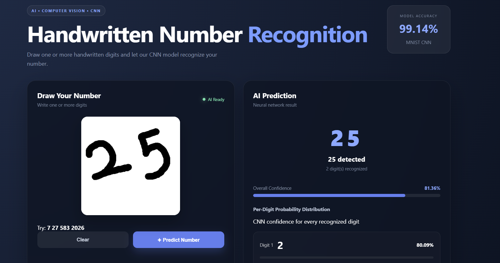

🧠 Handwritten Number Recognition AI

AI-powered handwritten number recognition using CNN, TensorFlow,
OpenCV, and Flask.

📌 Project Overview

Handwritten Number Recognition AI is a web-based computer vision and
deep learning application that recognizes handwritten single-digit and
multi-digit numbers.

Users can draw numbers on an interactive web canvas. The application
processes the drawing with OpenCV, separates individual digits, converts
them into MNIST-style 28 × 28 images, and uses a CNN model to predict
each digit.

The project combines deep learning, computer vision, image
preprocessing, Flask, JavaScript, and SQLite into one complete
application.

🖥️ Application Preview

{=html}

✨ Features

✍️ Interactive drawing canvas

🖱️ Mouse and touchscreen support

🔢 Single-digit recognition

🔢 Double-digit recognition

🔢 Triple-digit recognition

🔢 Multi-digit number recognition

🔟 Support for up to 10 detected digits

🤖 CNN-based digit classification

📊 Per-digit confidence scores

📈 Probability distribution for every digit

🎯 Overall prediction confidence

✂️ Automatic digit segmentation

🖼️ OpenCV image preprocessing

📐 MNIST-style 28 × 28 normalization

🎯 Center-of-mass correction

🔄 Multiple preprocessing variants

📜 Prediction history

📊 Prediction analytics

💾 SQLite database

🌐 Flask web application

📱 Responsive user interface

🧠 Machine Learning Model

The project uses a Convolutional Neural Network (CNN) trained on the
MNIST handwritten digit dataset.

Dataset

Property          Value

Training images   60,000
Testing images    10,000
Image size        28 × 28 pixels
Classes           10
Digits            0 to 9
Model             Convolutional Neural Network
Framework         TensorFlow / Keras
Test accuracy     99.14%

CNN Architecture

Input: 28 × 28 × 1
        ↓
Conv2D: 32 filters
        ↓
MaxPooling
        ↓
Conv2D: 64 filters
        ↓
MaxPooling
        ↓
Flatten
        ↓
Dense: 128 neurons
        ↓
Dropout
        ↓
Dense: 10 neurons
        ↓
Softmax

🔄 Recognition Pipeline

User Drawing
     │
     ▼
Canvas Image
     │
     ▼
Grayscale Conversion
     │
     ▼
Noise Removal
     │
     ▼
Thresholding
     │
     ▼
Contour Detection
     │
     ▼
Digit Segmentation
     │
     ▼
Tight Cropping
     │
     ▼
Aspect-Ratio Preservation
     │
     ▼
28 × 28 MNIST Normalization
     │
     ▼
Center-of-Mass Correction
     │
     ▼
Multiple Preprocessing Variants
     │
     ▼
CNN Prediction
     │
     ▼
Per-Digit Probabilities
     │
     ▼
Final Number

🛠️ Technologies Used

Artificial Intelligence

TensorFlow

Keras

Convolutional Neural Networks

MNIST

Computer Vision

OpenCV

NumPy

Pillow

Backend

Python

Flask

SQLite

Frontend

HTML5

CSS3

JavaScript

Canvas API

📁 Project Structure

Handwritten-Digit-Recognition/
│
├── model/
│   └── digit_model.keras
│
├── screenshots/
│   └── dashboard.png
│
├── static/
│   ├── script.js
│   └── style.css
│
├── templates/
│   └── index.html
│
├── .gitignore
├── LICENSE
├── README.md
├── app.py
├── requirements.txt
└── train.py

⚙️ Installation

1. Clone the repository

git clone https://github.com/Pratikfating123/handwritten-number-recognition-ai.git

2. Enter the project directory

cd handwritten-number-recognition-ai

3. Create a virtual environment

python -m venv venv

4. Activate the virtual environment

Windows PowerShell:

.\venv\Scripts\Activate.ps1

5. Install dependencies

pip install -r requirements.txt

▶️ Run the Application

Start the Flask server:

python app.py

Open your browser:

http://127.0.0.1:5000

Draw a number such as:

27
583
2026

Then click Predict Number.

🧪 Train the Model

To retrain the CNN using the MNIST dataset:

python train.py

The trained model is saved to:

model/digit_model.keras

📊 API Endpoints

Method   Endpoint            Description

GET    /                 Web application
POST   /predict          Predict a handwritten number
GET    /history          Retrieve prediction history
POST   /history/clear    Clear prediction history
GET    /analytics        Retrieve prediction analytics
GET    /health           Check application and model status
GET    /api/security     Check model and application status
GET    /api/interfaces   Get application interface information

📈 Example Prediction

Input:
583

Prediction:
583

Digit Count:
3

Overall Confidence:
High

The application also provides an individual confidence score and
probability distribution for each recognized digit.

🎓 Concepts Demonstrated

This project demonstrates practical knowledge of:

Convolutional Neural Networks

Deep Learning

Computer Vision

Image Classification

Image Preprocessing

Thresholding

Contour Detection

Digit Segmentation

Feature Extraction

Probability Prediction

Model Evaluation

REST API Development

Database Integration

Frontend and Backend Integration

🔮 Future Improvements

Real-time prediction while drawing

Custom handwriting dataset

Improved handwriting-style adaptation

More robust multi-digit segmentation

Model comparison and benchmarking

Prediction image export

Docker support

Cloud deployment

Mobile application

AI-generated prediction explanations

👨‍💻 Author

Pratik Fating

MCA Cybersecurity Student

GitHub:
https://github.com/Pratikfating123

LinkedIn:
https://www.linkedin.com/in/pratik-fating-153448273/

⭐ Support

If you find this project useful, please consider giving the repository a
⭐ star on GitHub.

📜 License

This project is licensed under the MIT License.